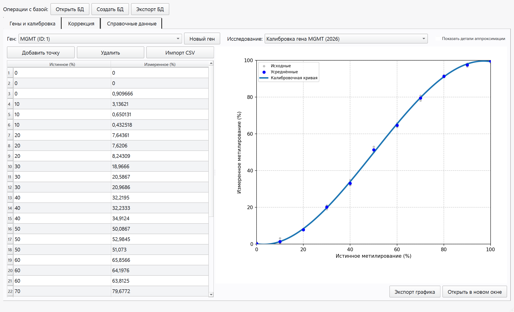
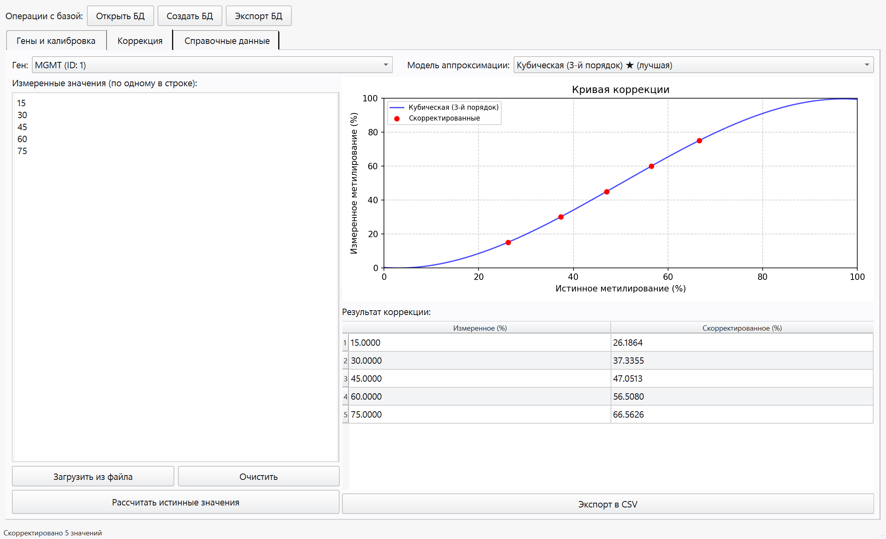
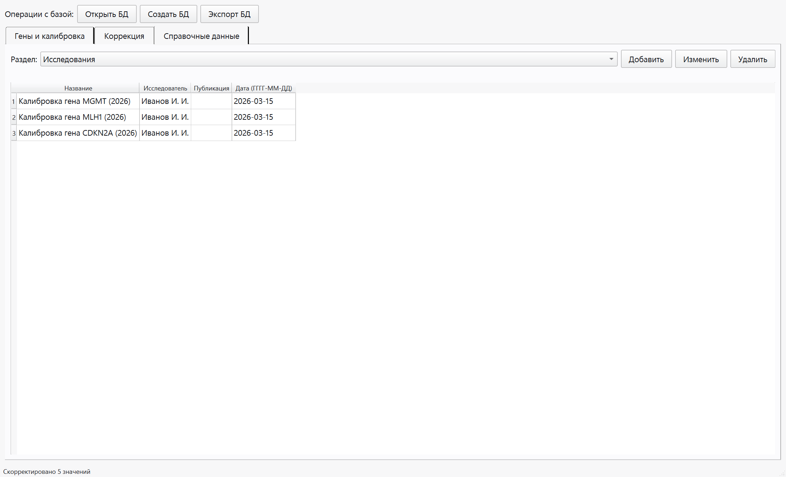

# Менеджер метилирования

Настольное приложение для хранения данных о метилировании ДНК, построения
калибровочных кривых и исправления искажённых измерений.

Прибор, измеряющий уровень метилирования, вносит систематическую ошибку.
По набору эталонных образцов (с известным истинным значением) программа строит
калибровочную кривую, а затем по ней восстанавливает истинные значения новых
измерений (коррекция).

## Возможности

- Хранение генов, калибровочных точек и сопутствующих данных в одном файле
  SQLite.
- Привязка измерений к конкретному исследованию.
- Автоматическое построение трёх моделей аппроксимации (кубический полином,
  гипербола со сдвигом, комбинированная функция) методом наименьших квадратов
  и выбор лучшей по среднеквадратичному отклонению.
- Коррекция измерений по выбранной модели, экспорт результатов в CSV.
- Встроенная визуализация калибровочных кривых (Matplotlib) с выводом формул
  и метрик качества.
- Редактор справочных данных (исследователи, публикации, реактивы и др.).
- Кнопка «Запустить демонстрацию» создаёт готовый пример для быстрого знакомства.

## Скриншоты

| Стартовое окно | Калибровка |
|---|---|
|  |  |

| Коррекция | Справочные данные |
|---|---|
|  |  |

## Технологии

- Python 3.10+
- PySide6 (Qt for Python) — графический интерфейс
- SQLite — встраиваемая база данных
- NumPy, SciPy — подбор коэффициентов аппроксимации
- Matplotlib — построение графиков

## Запуск из исходного кода

```bash
pip install -r requirements.txt
python main.py
```

При запуске откроется стартовое окно: можно открыть существующую базу, создать
новую или нажать «Запустить демонстрацию».

## Структура проекта

| Файл | Назначение |
|---|---|
| `main.py` | Точка входа: стартовый диалог и главное окно |
| `tabs.py` | Рабочие вкладки: калибровка, коррекция, справочные данные |
| `approx.py` | Аппроксимирующие функции, подбор параметров и коррекция |
| `compute.py` | Пересчёт усреднений и метрик аппроксимации |
| `db.py` | Схема и операции с базой данных SQLite |
| `formatters.py` | Форматирование чисел и формул |
| `resources.py` | Локализованные строки интерфейса |
| `utils.py` | Разбор CSV/TXT-файлов |
| `workers.py` | Фоновые потоки для пересчёта |
